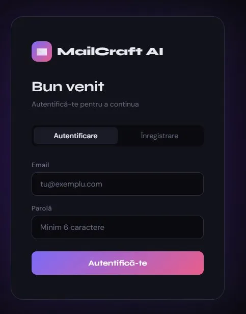
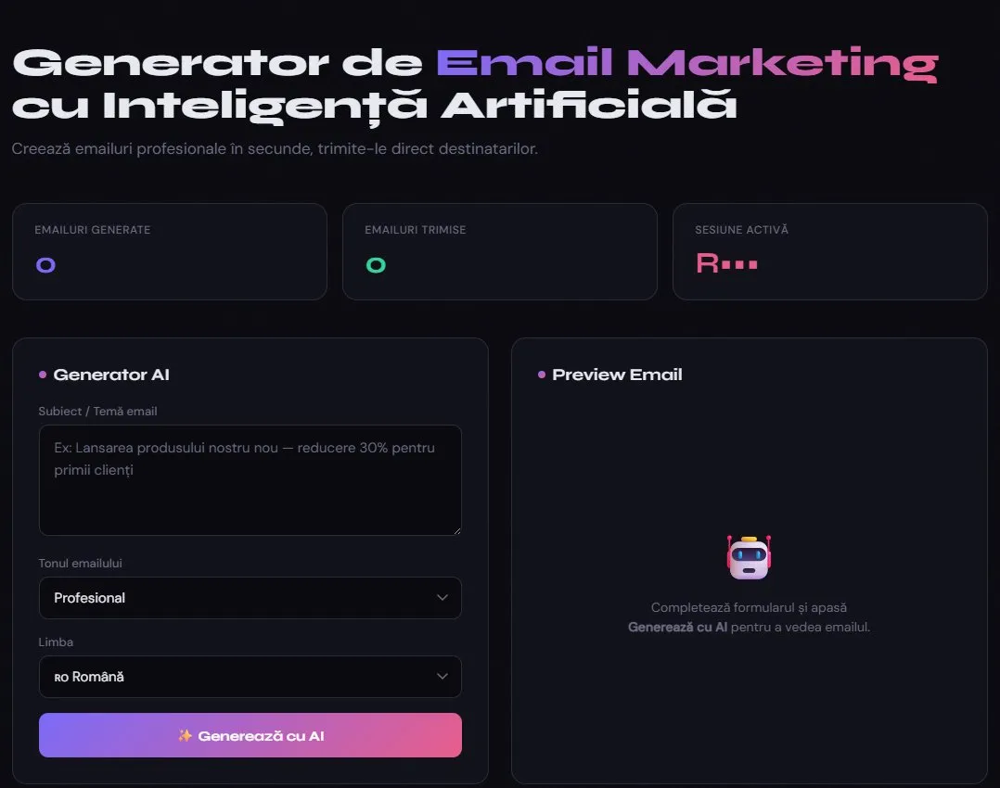
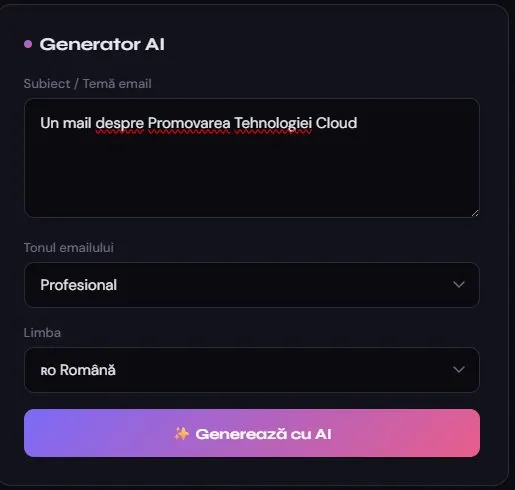
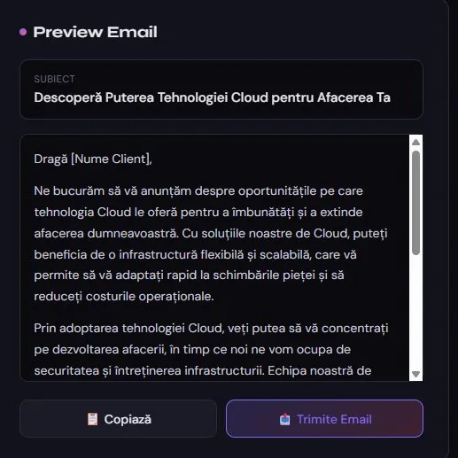
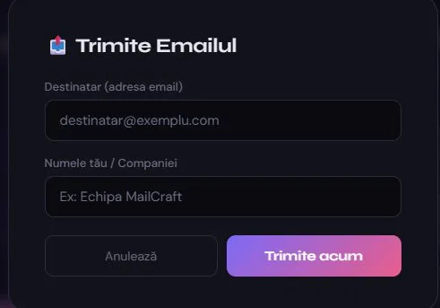
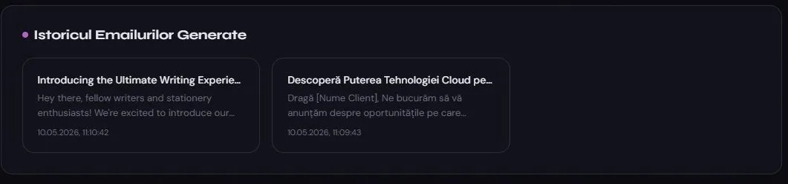

# MailCraft AI — Email Marketing cu Inteligență Artificială

**Nume:** Vasluianu Radu-Mihai  

**🔗 Link aplicație:** https://email-marketing-ai-production.up.railway.app/  
**🔗 Link video demonstrativ:** https://www.youtube.com/watch?v=9P6vJY0k7VI  
**🔗 Cod sursă:** https://github.com/Leradox/email-marketing-ai

---

## 1. Introducere

**MailCraft AI** este o aplicație web de email marketing care permite utilizatorilor să genereze automat emailuri profesionale folosind inteligență artificială și să le trimită direct către destinatari, totul dintr-o interfață modernă și intuitivă.

Aplicația rezolvă problema creării de conținut de calitate pentru campaniile de email marketing — un proces care în mod tradițional consumă timp și resurse. Prin integrarea AI, utilizatorul descrie doar tema emailului, iar aplicația generează automat un email complet, cu subiect și corp, gata de trimis.

---

## 2. Descriere problemă

Crearea de emailuri de marketing profesionale reprezintă o provocare pentru multe companii și antreprenori:

- **Timp:** Redactarea unui email de calitate poate dura ore
- **Costuri:** Angajarea unui copywriter este costisitoare
- **Consistență:** Menținerea unui ton profesional constant este dificilă

**MailCraft AI** rezolvă aceste probleme prin:
- Generarea automată a conținutului email folosind LLM (Large Language Model)
- Trimiterea directă a emailurilor fără a părăsi aplicația
- Salvarea istoricului emailurilor generate pentru referință ulterioară
- Sistem de autentificare pentru acces securizat și personalizat

---

## 3. Descriere API

Aplicația utilizează **2 servicii cloud externe** prin API REST și **1 serviciu cloud** pentru autentificare și stocare.

### 3.1 Groq API (Generare AI)

**Groq** oferă acces la modele LLM de mare performanță (Llama 3.3 70B) cu latență foarte mică.

**Endpoint folosit:**
```
POST https://api.groq.com/openai/v1/chat/completions
```

**Headers:**
```
Content-Type: application/json
Authorization: Bearer {GROQ_API_KEY}
```

**Request body:**
```json
{
  "model": "llama-3.3-70b-versatile",
  "messages": [
    {
      "role": "user",
      "content": "Generează un email de marketing profesional în limba română..."
    }
  ],
  "temperature": 0.7,
  "max_tokens": 1024
}
```

**Response:**
```json
{
  "choices": [
    {
      "message": {
        "content": "{\"subject\":\"Subiectul emailului\",\"body\":\"Corpul emailului...\"}"
      }
    }
  ]
}
```

---

### 3.2 Resend API (Trimitere Email)

**Resend** este un serviciu cloud pentru trimiterea de emailuri tranzacționale prin API REST.

**Endpoint folosit:**
```
POST https://api.resend.com/emails
```

**Headers:**
```
Content-Type: application/json
Authorization: Bearer {RESEND_API_KEY}
```

**Request body:**
```json
{
  "from": "onboarding@resend.dev",
  "to": ["destinatar@exemplu.com"],
  "subject": "Subiectul emailului generat de AI",
  "html": "<div>Corpul emailului în format HTML...</div>"
}
```

**Response succes:**
```json
{
  "id": "re_123abc456"
}
```

**Response eroare:**
```json
{
  "statusCode": 422,
  "message": "Invalid email address"
}
```

---

### 3.3 Firebase (Autentificare & Stocare)

**Firebase** oferă două servicii utilizate în aplicație:

**Firebase Authentication** — autentificare cu email și parolă:
```javascript
// Înregistrare
createUserWithEmailAndPassword(auth, email, password)

// Autentificare
signInWithEmailAndPassword(auth, email, password)

// Persistență automată la refresh
onAuthStateChanged(auth, (user) => { ... })
```

**Firestore Database** — stocare emailuri generate:
```javascript
// Salvare email generat
addDoc(collection(db, 'emails'), {
  uid: currentUser.uid,
  subject: "...",
  body: "...",
  createdAt: new Date()
})

// Citire istoric
getDocs(query(
  collection(db, 'emails'),
  where('uid', '==', currentUser.uid),
  orderBy('createdAt', 'desc')
))
```

---

### 3.4 API-ul propriu (Backend Express)

Aplicația expune 2 endpoint-uri REST proprii:

#### `POST /api/generate`
Generează un email folosind Groq AI.

**Request:**
```json
{
  "topic": "Lansarea unui produs nou cu reducere 30%",
  "tone": "profesional",
  "language": "română"
}
```

**Response succes:**
```json
{
  "subject": "🚀 Lansare oficială: Economisește 30% astăzi!",
  "body": "Stimate client,\n\nSuntem încântați să anunțăm..."
}
```

**Response eroare:**
```json
{
  "error": "Eroare la generarea emailului: Invalid API Key"
}
```

#### `POST /api/send`
Trimite emailul prin Resend.

**Request:**
```json
{
  "to": "destinatar@exemplu.com",
  "subject": "Subiectul emailului",
  "body": "Corpul emailului...",
  "senderName": "Echipa MailCraft"
}
```

**Response succes:**
```json
{
  "success": true,
  "id": "re_abc123"
}
```

**Metode HTTP utilizate:**
| Metodă | Endpoint | Descriere |
|--------|----------|-----------|
| POST | `/api/generate` | Generează email cu AI |
| POST | `/api/send` | Trimite emailul prin Resend |

---

### 3.5 Autentificare și autorizare servicii

| Serviciu | Tip autentificare | Unde e stocată cheia |
|----------|-------------------|----------------------|
| Groq API | API Key în header `Authorization: Bearer` | Variabilă de mediu `GROQ_API_KEY` |
| Resend API | API Key în header `Authorization: Bearer` | Variabilă de mediu `RESEND_API_KEY` |
| Firebase | SDK cu `firebaseConfig` (public) + reguli Firestore | Frontend (config public) |

Cheile API **nu sunt incluse în codul sursă** — sunt stocate în fișierul `.env` local și în variabilele de mediu Railway pentru producție.

---

## 4. Flux de date

```
Utilizator
    │
    ▼
[Browser — index.html]
    │
    ├─── Autentificare ──────────────► [Firebase Auth]
    │                                        │
    │                                   Token sesiune
    │                                   (persistă la refresh)
    │
    ├─── Generare email ─────────────► [Backend Express /api/generate]
    │         │                                │
    │    topic + tone + language               ▼
    │                                   [Groq API — Llama 3.3]
    │                                          │
    │                                   JSON {subject, body}
    │                                          │
    │         ◄────────────────────────────────┘
    │         │
    │    Afișare preview
    │         │
    │    Salvare în ──────────────────► [Firestore Database]
    │    Firestore
    │
    └─── Trimitere email ────────────► [Backend Express /api/send]
              │                                │
         to + subject + body                   ▼
                                        [Resend API]
                                               │
                                        Email livrat în inbox
```

---

## 5. Capturi ecran aplicație

### Ecran autentificare
Utilizatorul se poate autentifica sau înregistra cu email și parolă. Sesiunea persistă la refresh prin Firebase Authentication.



### Dashboard principal
După autentificare, utilizatorul vede statisticile sesiunii (emailuri generate, trimise) și formularul de generare.



### Generator AI — completare formular
Utilizatorul introduce tema emailului, selectează tonul și limba dorită.



### Preview email generat
Emailul generat de AI apare instant în panoul de preview, cu subiect și corp complet redactat.



### Trimitere email
Prin modalul de trimitere, utilizatorul introduce adresa destinatarului și numele companiei.



### Istoricul emailurilor generate
Toate emailurile generate sunt salvate în Firestore și afișate în istoric, cu dată și oră.



## 6. Referințe

- [Groq API Documentation](https://console.groq.com/docs/openai)
- [Resend API Documentation](https://resend.com/docs/api-reference/emails/send-email)
- [Firebase Authentication](https://firebase.google.com/docs/auth)
- [Firebase Firestore](https://firebase.google.com/docs/firestore)
- [Express.js](https://expressjs.com/)
- [Railway — Deployment Platform](https://railway.app/)
- [Node.js](https://nodejs.org/)
